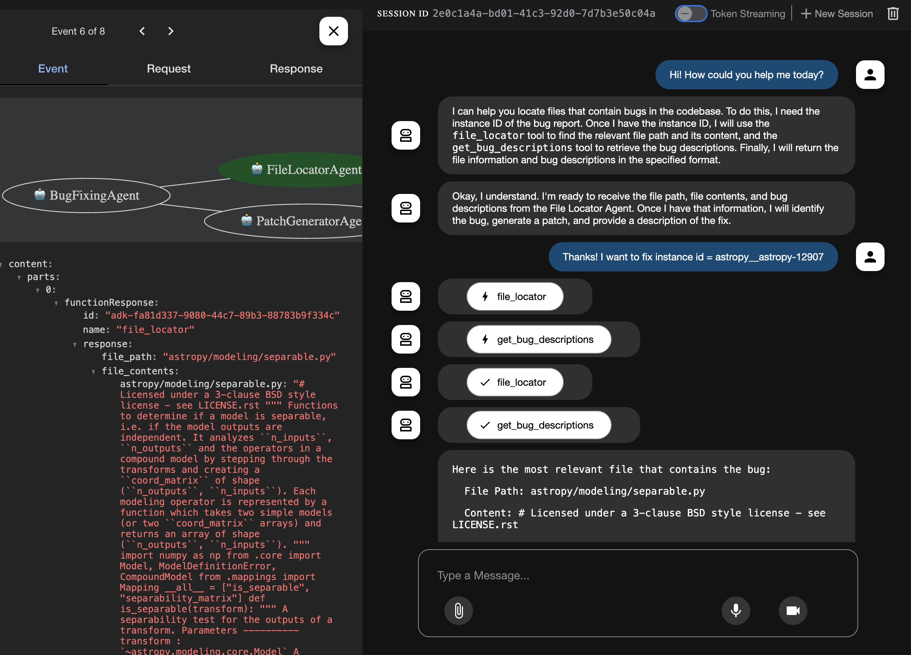

# agdk-swe-fixer
A bug-fixing agent using the Google Agentic Development Kit (AGDK) and the SWE-bench Lite dataset, focused on single-file, single-line bugs. This example builds a single-agent system that leverages the Google AI Studio free API Key for calling Gemini.

## Environmental Setup
Create a `.env` file to include:
```
HF_TOKEN=<YOUR_HUGGINGFACE_TOKEN>
GOOGLE_API_KEY=<YOUR_GOOGLE_API_KEY>
```

And set up virtual environment to install required packages:
```
python3 -m venv agdk-env     
source agdk-env/bin/activate         
pip install -r requirements.txt
pip install -r agentless/requirements.txt    
```

## (Optional, already downloaded) Download SWE-Bench-Lite to csv
```
huggingface-cli login    
```
```
python SWE-Bench-Lite/get-dataset.py
```

## Run agdk-swe-fixer pipeline:
1. Load the repo from **SWE-Bench-Lite** via `Agentless` file localization (it might take about 5~10 minutes depending on the wifi status):
```
python agentless/fl/localize.py --load_repo --num_threads 10 --skip_existing 
```
You would then pull the top 7 repos for simple demo. The number could be modified in the future.

2. (Optional, already implemented the top 7 dataset) Preprocess: Agentless

Please refer to 
[AGENTLESS README IN AGDK-SWE-FIXER](https://github.com/Unabashed0501/agdk-swe-fixer/tree/main/agentless#readme)

3. Run Bug Fixing Agent via Google Agentic Development Kit
```
adk web
```

You could access the web via [localhost:8080](http://0.0.0.0:8000/dev-ui?app=BugFixerAgent) by default, and please select **BugFixingAgent** to interact with the agent.

## 🚀 Project Demo

Here is a short demo of how the project works:

[](Demo/Demo_video_agdk_swe_fixer.mp4)


## Reference
The `agentless` folder is referred to 
```bibtex
@article{agentless,
  author    = {Xia, Chunqiu Steven and Deng, Yinlin and Dunn, Soren and Zhang, Lingming},
  title     = {Agentless: Demystifying LLM-based Software Engineering Agents},
  year      = {2024},
  journal   = {arXiv preprint},
}
```

## Acknowledgement 

* [SWE-bench](https://www.swebench.com/)
* [Agentless](https://github.com/OpenAutoCoder/Agentless/tree/main)
